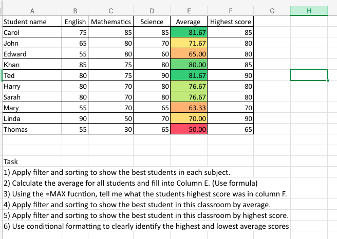

# 📊 Retail Sales Analysis – Excel Project

This project is an Excel-based analysis of a retail sales dataset.  
It demonstrates my skills as an **Entry-Level Data Technician**, focusing on essential data-cleaning, analysis, and visualization techniques using Excel’s core features.

---

## 🎯 Project Overview
The goal of this project is to practice working with structured datasets and apply key Excel tools, including formulas, pivot tables, conditional formatting, charts, and interactive slicers.

---

## 🧰 Skills & Techniques Used

### 🔢 **Excel Functions**
I used several fundamental functions for data calculation and summary:
- `SUM(),SUMIF(), SUMIFS()`
- `AVERAGE()`
- `MAX()`
  
📸 **Screenshots:**  
.png)
-
.png)
-
.png)
-
.png)

---

### 🎛️ **Pivot Tables**
I built multiple pivot tables to summarize sales by:
- Product Category  
- Gender  
- Total Sales  

These pivot tables help extract insights from the dataset efficiently.

### 🎨 **Conditional Formatting**
Used conditional formatting to highlight:
- High or low values  
- Key categories  
- Important metrics in tables  

This makes the dataset more readable and visually clear.

---

### 🧩 **Slicers**
Interactive slicers were added to allow quick filtering of pivot table results, improving the usability of the report.

### 📈 **Charts**
I created charts to visualize the summarized data, making it easier to interpret trends and comparisons.

📸 **Screenshots:**  

---

## 📄 Project Files
- **Excel Workbook:** Contains raw data, calculations, pivot tables, slicers, and charts.  
  *(Upload your `.xlsx` file to the GitHub repository so users can explore it.)*

---

## 🚀 What This Project Demonstrates
- Ability to clean, structure, and analyze data in Excel  
- Use of dynamic functions to create flexible views  
- Building pivot tables for business insights  
- Applying conditional formatting for clarity  
- Creating charts and interactive elements to improve data exploration  

This project reflects my growing skills as a **Data Technician** and my commitment to improving through hands-on practice.

---

If you'd like to see more projects or follow my progress, feel free to check out the rest of my GitHub! 🚀
